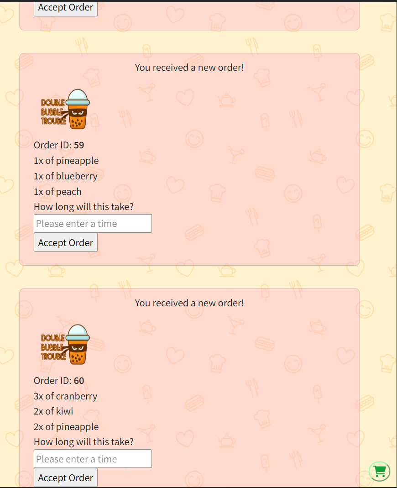
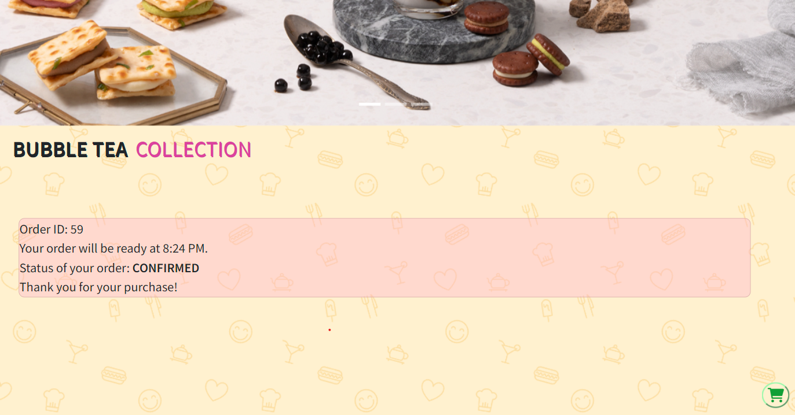

# Food Pick-up Ordering App

## Features

A single page food ordering experience for a single restaurant. Hungry clients of this fictitious bubble tea shop can visit our website, select one or more beverages and place an order for pick-up. They will receive notifications when their order is made, when the shop sets the time it takes to fullfil it and whenever it is ready.

## Getting Started

1. Git Clone this repo (using the `git clone https://github.com/iKayden/FoodOrderApp_MidTermProject` command).
2. Install all dependencies (using the `npm install` command).
3. Install our local SQL data base (using the `run local db:reset` command).
4. Start the web server using the `npm run local` command. The app will be served at <http://localhost:8080/>.
5. Go to <http://localhost:8080/> in your browser.

## Product Showcase

- It has a responsive, modern and charming design. It was made using the mobile-first approach. That's how it looks on a typical smartphone.

- Current photo shows the way it looks on a wider than phone screens.
- It has an actively updating cart with a possibility to add or decrease quantity of beverages user wants.
- NEED TO FIX AND CHANGE The page doesn't reload on order submission and redirects customer to the page with orders to see user pending order, which will be updated whenever the Administrator/Owner replies with time it takes to fullfil this order.
- The owner/admin has his own page with all the orders which can be taken, after fulfillment time is specified.
- The customer will be notified via sms messages and live update on his order page.

### Used Technologies

#### Back End:

    - NodeJS
    - PostgresSQL
    - Express
    - Git Version Control
    - Twilio API (messaging)

#### Front End:

    - jQuery
    - Sass/css
    - Java Script

## Dependencies

- node 10.x or above
- npm 5.x or above
- pg 6.x
- chalk
- cookie-parser
- express
- morgan
- twilio
- sass
- dotenv

### Made by [Kayden](https://github.com/iKayden), [Rosanna](https://github.com/rosanna-z) and [Eileen](https://github.com/lyjeileen)
